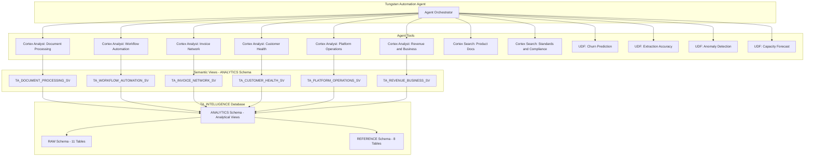

# Plan: Tungsten Automation Snowflake Intelligence Agent Demo

## Overview

Build a complete, production-ready Snowflake Intelligence Agent demo for Tungsten Automation. The agent consolidates platform operations data into a natural-language intelligence interface. **Key design change:** 6 domain-specific semantic views (one per business domain) instead of a single monolithic semantic view, giving Cortex Analyst better context and more targeted query generation.

## Architecture



## Semantic View Design (6 Domain-Specific Views)

### 1. `TA_DOCUMENT_PROCESSING_SV`
**Purpose:** IDP operations analytics — volumes, accuracy, classification, OCR model performance

| Tables included | Role |
|---|---|
| `DOCUMENT_PROCESSING_JOBS` | Core fact table |
| `EXTRACTION_RESULTS` | Field-level extraction metrics |
| `CLASSIFICATION_EVENTS` | Classification accuracy |
| `CUSTOMER_DIM` | Customer context |
| `PRODUCT_DIM` | Product context |
| `DUBLIN_CORE_DOCUMENT_TYPES` (REFERENCE) | Standard document type vocabulary |
| `OCR_MODEL_REGISTRY` (REFERENCE) | Model version context |

**Key metrics:** documents_processed, pages_processed, avg_confidence_score, extraction_accuracy_pct, manual_correction_rate, classification_accuracy_pct, avg_processing_time_sec

### 2. `TA_WORKFLOW_AUTOMATION_SV`
**Purpose:** TotalAgility/RPA workflow analytics — throughput, completion, failures

| Tables included | Role |
|---|---|
| `WORKFLOW_INSTANCES` | Core fact table |
| `CUSTOMER_DIM` | Customer context |
| `PRODUCT_DIM` | Product context |
| `APQC_PROCESS_TAXONOMY` (REFERENCE) | Business process classification |

**Key metrics:** workflows_completed, avg_completion_time_sec, failure_rate_pct, steps_completed, automation_rate_pct

### 3. `TA_INVOICE_NETWORK_SV`
**Purpose:** e-Invoice Network analytics — transaction volumes, compliance, delivery

| Tables included | Role |
|---|---|
| `INVOICE_NETWORK_TRANSACTIONS` | Core fact table |
| `CUSTOMER_DIM` | Customer context |
| `UBL_INVOICE_ELEMENTS` (REFERENCE) | Invoice standard elements |
| `EINVOICE_MANDATE_REGISTRY` (REFERENCE) | Compliance mandates |

**Key metrics:** invoices_processed, total_invoice_amount, avg_delivery_time_sec, rejection_rate_pct, compliance_match_rate

### 4. `TA_CUSTOMER_HEALTH_SV`
**Purpose:** Customer engagement, support, usage, and churn signals

| Tables included | Role |
|---|---|
| `CUSTOMER_SUBSCRIPTIONS` | Subscription facts |
| `CUSTOMER_USAGE_METRICS` | Daily usage |
| `SUPPORT_TICKETS` | Support interactions |
| `CUSTOMER_DIM` | Customer context |
| `PRODUCT_DIM` | Product context |
| `INDUSTRY_CLASSIFICATION` (REFERENCE) | Industry vertical context |

**Key metrics:** avg_csat_score, tickets_opened, tickets_resolved, avg_resolution_time_hours, utilization_pct, documents_vs_limit_pct, active_users

### 5. `TA_PLATFORM_OPERATIONS_SV`
**Purpose:** SaaS platform health, availability, performance

| Tables included | Role |
|---|---|
| `PLATFORM_HEALTH_METRICS` | Core fact table |
| `PRODUCT_DIM` | Product context |
| `ITIL_SERVICE_METRICS` (REFERENCE) | Standardized KPI definitions |

**Key metrics:** availability_pct, avg_response_ms, error_rate_pct, queue_depth, incidents_count

### 6. `TA_REVENUE_BUSINESS_SV`
**Purpose:** ARR, retention, subscription growth, product financials

| Tables included | Role |
|---|---|
| `CUSTOMER_SUBSCRIPTIONS` | Revenue facts |
| `CUSTOMER_USAGE_METRICS` | Usage correlation |
| `CUSTOMER_DIM` | Customer segmentation |
| `PRODUCT_DIM` | Product breakdown |
| `INDUSTRY_CLASSIFICATION` (REFERENCE) | Industry vertical |

**Key metrics:** arr_usd, document_volume_limit, renewal_rate_pct, net_retention_pct, customers_count, avg_arr_per_customer

## Agent Tool Routing

The agent's orchestration instructions will route questions to the appropriate semantic view:

```
- Document processing, extraction, OCR, classification questions → DocumentProcessingAnalyst
- Workflow, TotalAgility, RPA, process automation questions → WorkflowAutomationAnalyst
- Invoice, e-invoice, Peppol, compliance, mandate questions → InvoiceNetworkAnalyst
- Customer health, support, CSAT, usage, churn questions → CustomerHealthAnalyst
- Platform availability, error rates, performance, capacity questions → PlatformOperationsAnalyst
- ARR, revenue, retention, subscription, growth questions → RevenueBusinessAnalyst
- Product documentation, how-to, best practices questions → ProductDocsSearch
- Standards, APQC, UBL, ITIL, GDPR, compliance text questions → StandardsComplianceSearch
- Churn prediction, anomaly detection, forecasting questions → ML UDF tools
```

## File Delivery (in execution order)

| # | File | Purpose |
|---|------|---------|
| 1 | `sql/setup/01_database_and_schema.sql` | Database TA_INTELLIGENCE, schemas RAW/ANALYTICS/REFERENCE, warehouse |
| 2 | `sql/setup/02_create_tables.sql` | All 19 table DDLs (11 RAW + 8 REFERENCE) |
| 3 | `sql/data/03_generate_synthetic_data.sql` | 12 months synthetic data (~500K doc jobs, 100 customers) |
| 3b | `sql/data/03b_seed_industry_standards.sql` | APQC PCF, Dublin Core, UBL, ITIL, NAICS, GDPR seeds |
| 4 | `sql/views/04_create_views.sql` | Analytical views joining RAW + REFERENCE |
| 5 | `sql/views/05_create_semantic_views.sql` | **6 domain-specific semantic views** |
| 6 | `sql/search/06_create_cortex_search.sql` | Two Cortex Search services |
| 7 | `notebooks/07_ml_models.ipynb` | 4 ML models trained and registered |
| 8 | `sql/models/08_ml_model_functions.sql` | UDFs calling registered models |
| 9 | `sql/agent/09_create_agent.sql` | Agent with 6 Analyst tools + 2 Search + 4 UDFs |

## Documentation and Diagrams

| File | Content |
|------|---------|
| `README.md` | Project overview, quickstart, architecture summary |
| `docs/AGENT_SETUP.md` | Step-by-step deployment guide |
| `docs/DEPLOYMENT_SUMMARY.md` | Component status tracking |
| `docs/questions.md` | 30+ demo questions organized by domain |
| `docs/images/architecture.svg` | System architecture diagram (showing 6 SVs) |
| `docs/images/deployment_flow.svg` | Execution order flowchart |
| `docs/images/ml_models.svg` | ML pipeline visualization |

## Synthetic Data Design (12 months)

- **100 customers** across 5 industries and 3 segments
- **~500K document processing jobs** across 6 products
- **~2M extraction results** (avg 4 fields per doc)
- **~500K classification events**
- **~150K workflow instances** across 20 workflow types
- **~800K e-invoice transactions** across 40 countries
- **100 subscriptions** with realistic ARR distribution ($50K–$5M)
- **~36,500 usage metric rows** (100 customers x 365 days)
- **~5K support tickets**
- **~52K platform health rows** (sampled)

## ML Models (4 total)

1. **Customer Churn Risk** — Binary classification based on usage decline, support patterns, contract dates
2. **Extraction Accuracy Prediction** — Regression on doc type x model version accuracy
3. **Invoice Processing Anomaly Detection** — Isolation Forest on transaction patterns
4. **Platform Capacity Forecasting** — Time-series regression on queue depth by region

## Key Design Decisions

- **6 semantic views** (one per domain) instead of 1 monolithic view — gives Cortex Analyst tighter context per domain and avoids confusion from too many tables/metrics in one view
- **Agent orchestration routes by keyword/intent** — the orchestration instruction maps question topics to the correct Analyst tool
- **REFERENCE schema tables join into semantic views** where they add value (e.g., APQC in Workflow, Dublin Core in Document Processing, UBL in Invoice Network)
- **Two Cortex Search services** for unstructured/semi-structured knowledge
- **4 ML UDF tools** for predictive capabilities
- **Pure SQL data generation** — no external dependencies
- **All files complete, no placeholders** — ready to execute in sequence

## Critical Files

- `sql/views/05_create_semantic_views.sql` — Core deliverable; 6 semantic views with proper TABLES/DIMENSIONS/METRICS syntax
- `sql/agent/09_create_agent.sql` — Agent YAML wiring 6 Analyst tools + 2 Search + 4 UDFs with routing instructions
- `sql/data/03_generate_synthetic_data.sql` — Largest file; must generate realistic correlated data across all tables
- `sql/data/03b_seed_industry_standards.sql` — Reference data that powers the ontology layer in semantic views
- `notebooks/07_ml_models.ipynb` — 4 models trained and registered via Model Registry
