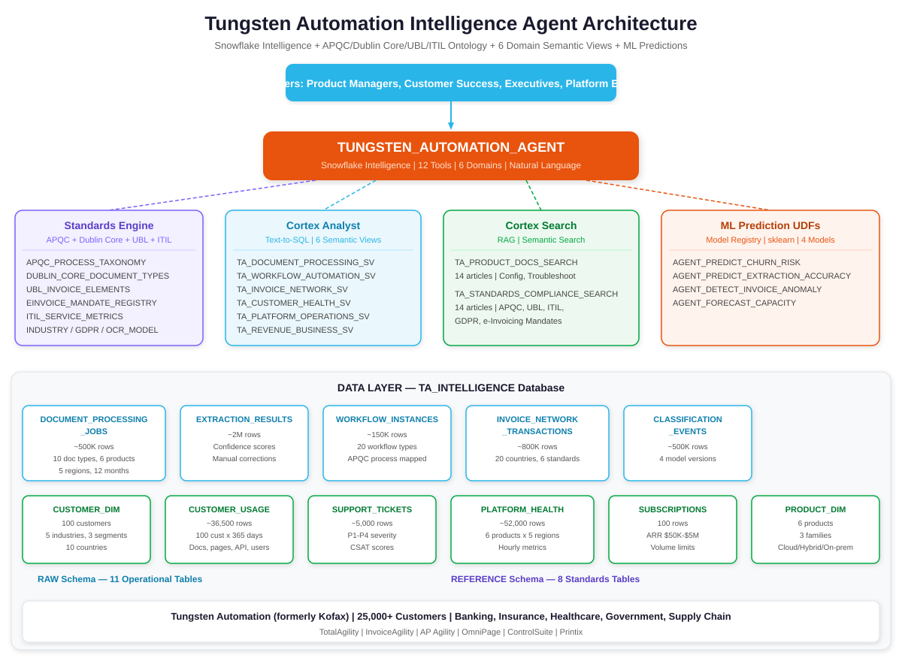
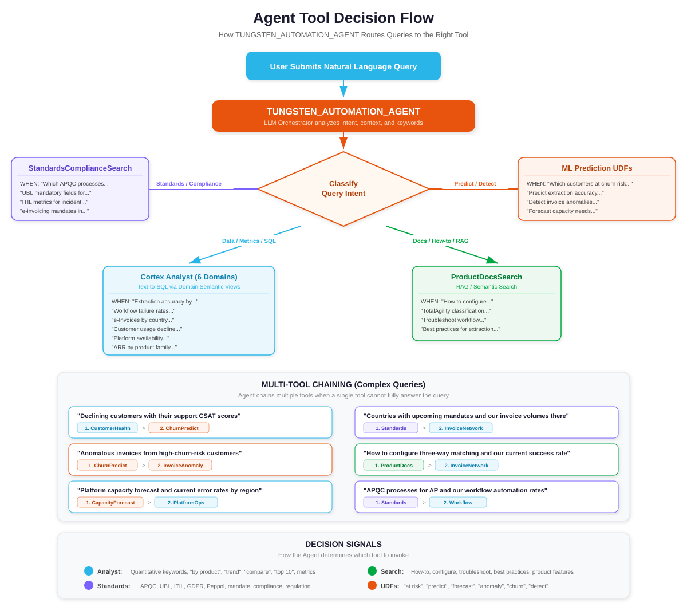
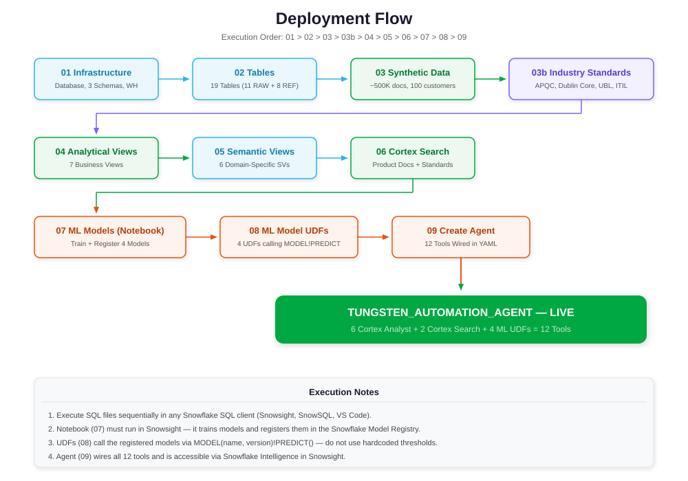
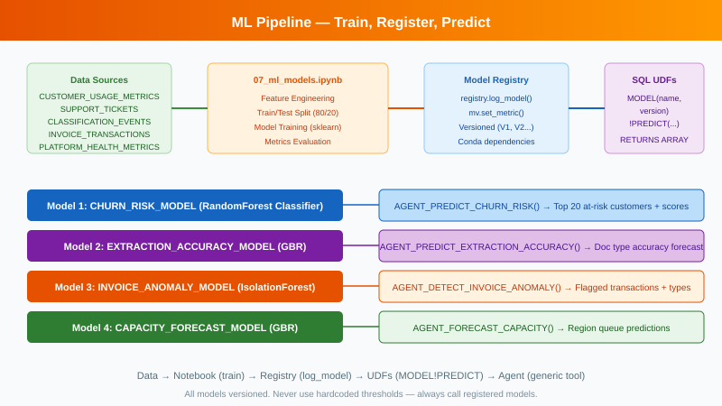

# Tungsten Automation Platform Operations Intelligence Agent

A Snowflake Intelligence agent that consolidates platform operations, customer health, invoice network, and revenue data so internal teams can ask questions of their business directly — replacing siloed dashboards with governed, AI-driven analytics backed by industry-standard ontologies.

## Overview

Tungsten Automation (formerly Kofax) is the global leader in AI-powered intelligent document processing and workflow automation, serving 25,000+ enterprise customers across banking, insurance, healthcare, government, and supply chain. This project builds a natural-language intelligence agent that unifies fragmented operational data with a standards-based ontology layer (APQC PCF, Dublin Core, UBL/Peppol, ITIL 4) into a single governed source of truth.

## Architecture

## Data Model

### Operational Data (RAW Schema)

The synthetic data models the Tungsten Automation platform ecosystem across 6 products, 100 customers, and 12 months of operations:

| Table | Grain | Description |
|-------|-------|-------------|
| `DOCUMENT_PROCESSING_JOBS` | per job | Document processing across all IDP products (~500K rows) |
| `EXTRACTION_RESULTS` | job x field | Field-level extraction with confidence scores (~2M rows) |
| `CLASSIFICATION_EVENTS` | per job | Document classification decisions (~500K rows) |
| `WORKFLOW_INSTANCES` | per execution | TotalAgility/RPA workflow instances (~150K rows) |
| `INVOICE_NETWORK_TRANSACTIONS` | per transaction | e-Invoice Network exchanges (~800K rows) |
| `CUSTOMER_SUBSCRIPTIONS` | per customer x product | ARR, volume limits, renewal dates |
| `CUSTOMER_USAGE_METRICS` | customer x product x day | Daily usage (~36,500 rows) |
| `SUPPORT_TICKETS` | per ticket | Support cases with CSAT (~5K rows) |
| `PLATFORM_HEALTH_METRICS` | product x region x hour | Availability, errors, queue depth (~52K rows) |
| `CUSTOMER_DIM` | per customer | 100 customers across 5 industries |
| `PRODUCT_DIM` | per product | 6 products across 3 families |

### Reference / Ontology Layer (REFERENCE Schema)

Controlled vocabularies and industry standards joined to operational tables so the agent reasons in standardized, industry-recognized terms:

| Table | Description | Source Standard |
|-------|-------------|-----------------|
| `APQC_PROCESS_TAXONOMY` | Business process classification (37 processes) | APQC PCF v7.4 |
| `DUBLIN_CORE_DOCUMENT_TYPES` | Document type metadata taxonomy (20 types) | Dublin Core / ISO 15836 |
| `UBL_INVOICE_ELEMENTS` | Canonical invoice data elements (25 fields) | OASIS UBL 2.1 / Peppol BIS 3.0 |
| `EINVOICE_MANDATE_REGISTRY` | Global e-invoicing mandates (20 countries) | EU ViDA, SDI, GST, ZATCA |
| `ITIL_SERVICE_METRICS` | Platform KPI definitions (15 metrics) | ITIL 4 Service Value System |
| `INDUSTRY_CLASSIFICATION` | Customer vertical classification | NAICS + APQC mapping |
| `GDPR_DATA_CATEGORIES` | PII/PHI sensitivity categories (15 types) | GDPR Art. 9 / CCPA / HIPAA |
| `OCR_MODEL_REGISTRY` | IDP model version tracking (10 versions) | Internal |

## Agent Tools

| Tool | Type | Purpose |
|------|------|---------|
| DocumentProcessingAnalyst | Cortex Analyst | IDP volumes, extraction accuracy, classification, OCR metrics |
| WorkflowAutomationAnalyst | Cortex Analyst | TotalAgility/RPA execution, APQC process mapping |
| InvoiceNetworkAnalyst | Cortex Analyst | e-Invoice transactions, compliance, delivery metrics |
| CustomerHealthAnalyst | Cortex Analyst | Usage, support tickets, CSAT, churn signals |
| PlatformOperationsAnalyst | Cortex Analyst | Availability, error rates, queue depth, ITIL KPIs |
| RevenueBusinessAnalyst | Cortex Analyst | ARR, subscriptions, retention, renewal tracking |
| ProductDocsSearch | Cortex Search | Product documentation and best practices |
| StandardsComplianceSearch | Cortex Search | APQC, UBL, ITIL, GDPR, e-invoicing mandates |
| PredictChurnRisk | ML UDF | Customer churn classification (90-day) |
| PredictExtractionAccuracy | ML UDF | Extraction accuracy forecasting |
| DetectInvoiceAnomaly | ML UDF | Invoice processing anomaly detection |
| ForecastCapacity | ML UDF | Platform capacity forecasting |

## Agent Tool Routing

## Setup Instructions

See [docs/AGENT_SETUP.md](docs/AGENT_SETUP.md) for the complete step-by-step setup guide.

## File Execution Order

Files **must** be executed in this exact order:

1. `sql/setup/01_database_and_schema.sql`
2. `sql/setup/02_create_tables.sql`
3. `sql/data/03_generate_synthetic_data.sql`
4. `sql/data/03b_seed_industry_standards.sql`
5. `sql/views/04_create_views.sql`
6. `sql/views/05_create_semantic_views.sql`
7. `sql/search/06_create_cortex_search.sql`
8. `notebooks/07_ml_models.ipynb`
9. `sql/models/08_ml_model_functions.sql`
10. `sql/agent/09_create_agent.sql`

## ML Models

Four machine learning models are trained, registered in the Snowflake Model Registry, and exposed as UDFs for the agent:

| Model | Task | Features |
|-------|------|----------|
| Churn Risk | Binary Classification | avg_docs, usage_trend, ticket_count, avg_csat, days_to_renewal |
| Extraction Accuracy | Regression | sample_count, avg_pages, current_accuracy |
| Invoice Anomaly | Anomaly Detection | amount, delivery_time_sec, submit_hour |
| Capacity Forecast | Regression | avg_queue, std_queue, max_queue |

## Industry Ontology and Standards Layer

This agent incorporates a standards-based ontology layer that provides:

- **APQC PCF v7.4** — Cross-industry business process taxonomy for classifying what Tungsten products automate
- **Dublin Core (ISO 15836)** — Standard document type metadata vocabulary for cross-product analytics
- **OASIS UBL 2.1 / Peppol BIS 3.0** — Canonical invoice data elements for extraction coverage measurement
- **ITIL 4 Service Value System** — Standardized platform health KPI definitions
- **NAICS + APQC Industry Mapping** — Customer vertical classification with process automation focus
- **GDPR / CCPA / HIPAA** — Data privacy categories for PII/PHI classification in extraction

## Sample Questions

The agent ships with 14 sample questions demonstrating each tool:

| # | Type | Tool Demonstrated | Question |
|---|------|-------------------|----------|
| 1 | Simple | General | "How many documents did we process last month?" |
| 2 | Complex (multi-tool) | Churn + Customer + Revenue + Standards | "Show me top 5 churn-risk customers with ARR, CSAT, usage, and mandate exposure" |
| 3 | Tool-specific | DocumentProcessingAnalyst | "Average extraction accuracy by product this month?" |
| 4 | Tool-specific | WorkflowAutomationAnalyst | "Which workflows have the highest failure rates?" |
| 5 | Tool-specific | InvoiceNetworkAnalyst | "How many e-invoices processed by country this quarter?" |
| 6 | Tool-specific | CustomerHealthAnalyst | "Which customers have declining volumes month over month?" |
| 7 | Tool-specific | PlatformOperationsAnalyst | "Platform availability by region for the last week" |
| 8 | Tool-specific | RevenueBusinessAnalyst | "Total ARR by product family?" |
| 9 | Tool-specific | ProductDocsSearch | "How do I configure three-way matching?" |
| 10 | Tool-specific | StandardsComplianceSearch | "Which APQC processes relate to accounts payable?" |
| 11 | Tool-specific | PredictChurnRisk | "Which customers are at highest churn risk?" |
| 12 | Tool-specific | PredictExtractionAccuracy | "Which document types need model retraining?" |
| 13 | Tool-specific | DetectInvoiceAnomaly | "Any anomalous invoice transactions in 30 days?" |
| 14 | Tool-specific | ForecastCapacity | "Do we need to scale any regions?" |

See [docs/questions.md](docs/questions.md) for 46 additional complex test questions spanning all domains.

## Technology Stack

- **Snowflake Intelligence** — Natural language agent interface
- **Cortex Analyst** — Text-to-SQL over 6 domain-specific semantic views
- **Cortex Search** — Semantic search over product docs and standards/compliance text
- **Snowflake Model Registry** — ML model management and inference
- **Snowpark ML** — Model training and registration
- **APQC / Dublin Core / UBL / ITIL / GDPR** — Industry standards backbone

## Version

- **v1.0** — August 2026
- **Customer**: Tungsten Automation
- **Domain**: Intelligent Document Processing, Workflow Automation, Enterprise Platform Operations
- **Web**: https://www.tungstenautomation.com/
